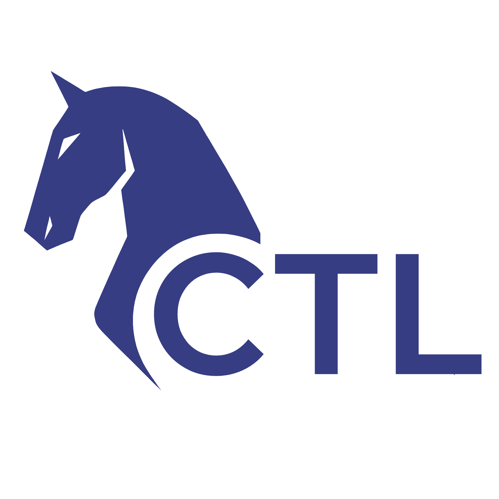
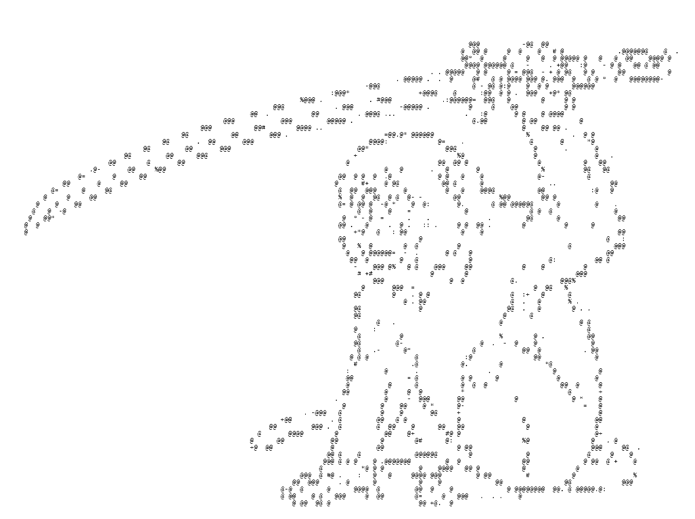

# Michael Kocovic

Applications developer specializing in AutoCAD automation and geometric modeling tools.

### Current Projects

  

  <h3>CTL (CAD Topology Language)</h3>

  

    A domain-specific language for CAD topology and geometric modeling.
    Token-efficient and purpose-built with clean syntax, CTL simplifies
    complex topological operations and geometric transformations for
    computational geometry workflows.
  

   

  

  <h3>Chariot</h3>

  

    Web-based IDE and development platform for CTL. Provides an intuitive
    interface for writing, debugging, and executing topological geometry
    programs with real-time feedback and visualization capabilities,
    enabling rapid development of CAD applications.
  

   

  
   

- **Languages:** C#, C++
- **Tools & Platforms:** AutoCAD, Visual Studio, .NET
- **Specialization:** CAD automation, geometric modeling, DSL design
